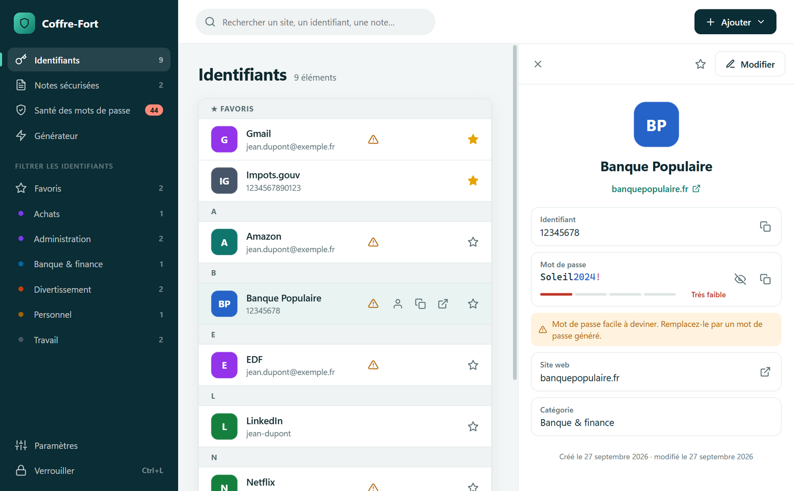
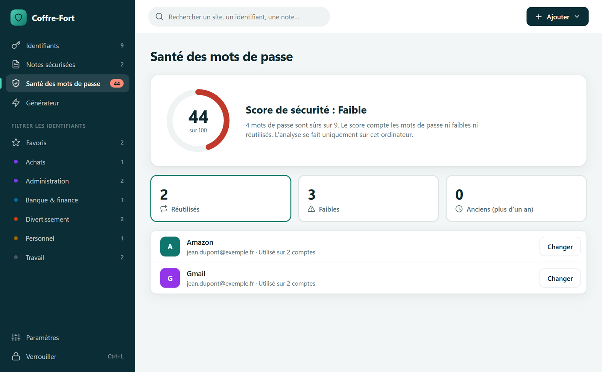
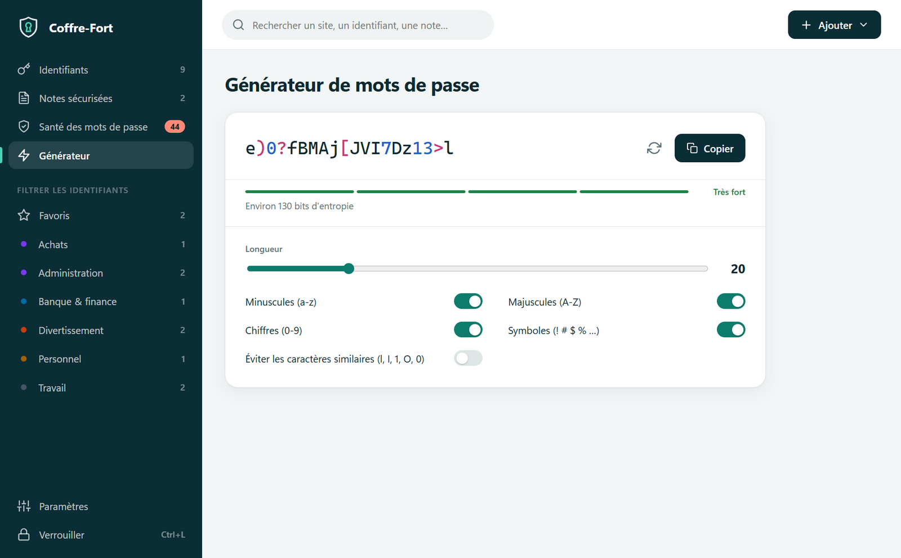
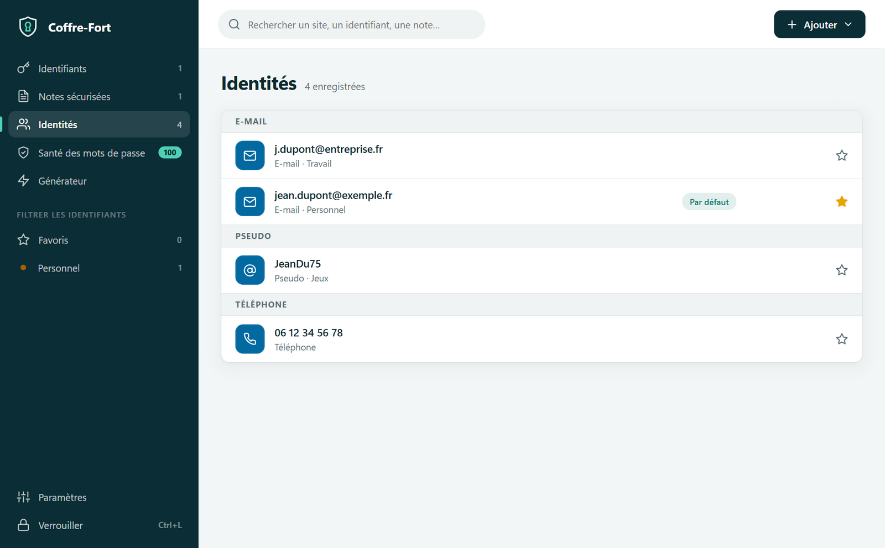
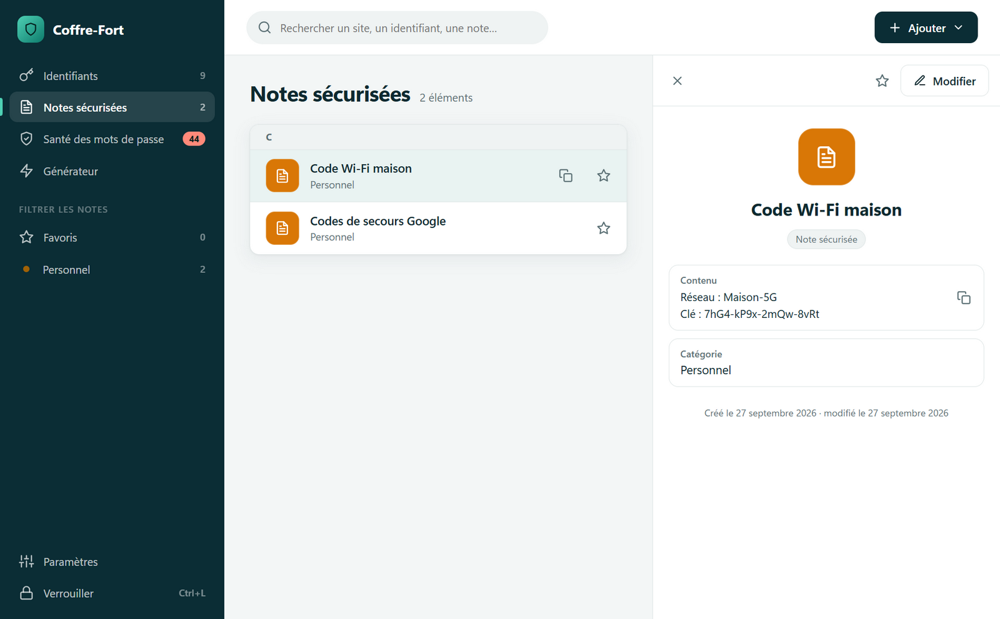
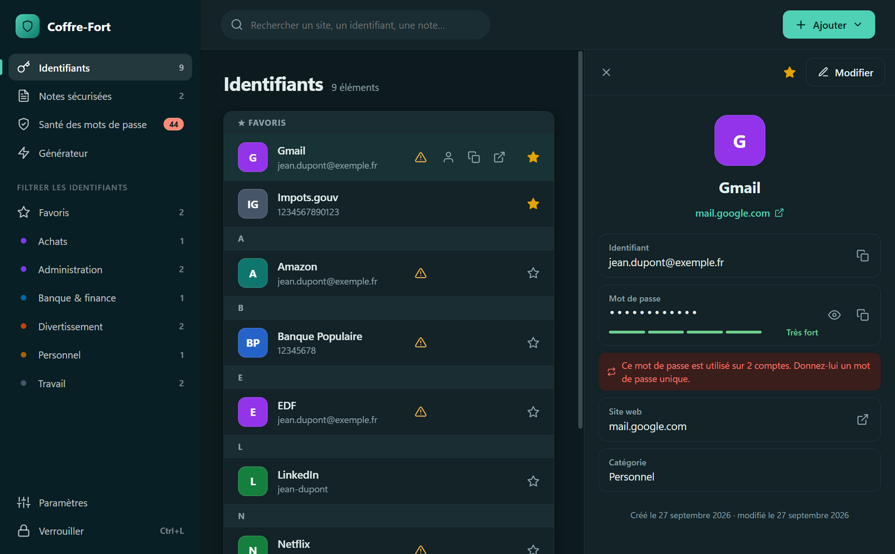
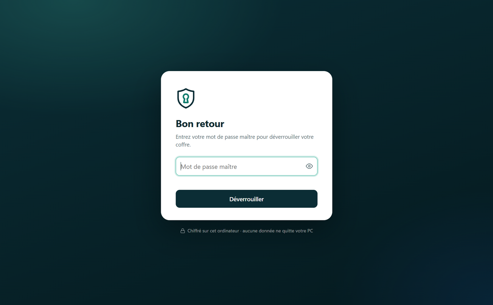

<div align="center">

<picture>
  <source media="(prefers-color-scheme: dark)" srcset="build/logo-dark.svg">
  
</picture>

# Coffre-Fort

**Gestionnaire de mots de passe local, chiffré et open source pour Windows**

[](https://github.com/EaglesFPV/Coffre-Fort/releases/latest)
[](https://github.com/EaglesFPV/Coffre-Fort/actions/workflows/build.yml)
[](LICENSE)


[**Télécharger**](https://github.com/EaglesFPV/Coffre-Fort/releases/latest) ·
[Sécurité](SECURITY.md) ·
[Développement](#développement)



</div>

---

## Pourquoi Coffre-Fort

Vos mots de passe restent **sur votre ordinateur**, dans un seul fichier chiffré. Aucun compte à créer,
aucun serveur, aucun abonnement. L'interface s'inspire des meilleurs gestionnaires du marché, et la
sécurité repose sur des algorithmes standards et éprouvés : **Argon2id** et **AES-256-GCM**.

## Fonctionnalités

| | |
|---|---|
| **Identifiants** | Nom, identifiant, mot de passe, site, catégorie et notes. Copie en un clic, ouverture du site. |
| **Notes sécurisées** | Codes Wi-Fi, codes de secours, licences : tout ce qui doit rester secret. |
| **Identités** | Vos e-mails, pseudos, téléphones et noms, copiables en un clic. L'identité par défaut préremplit les nouveaux identifiants, les autres sont suggérées. |
| **Santé des mots de passe** | Score sur 100 et liste des mots de passe réutilisés, faibles ou anciens, analysés localement. |
| **Générateur** | De 8 à 64 caractères, choix des catégories, caractères ambigus évitables, entropie affichée. |
| **Organisation** | Catégories, favoris épinglés, recherche instantanée, regroupement alphabétique. |
| **Intégration Windows** | Zone de notification, lancement au démarrage, réduction au lieu de fermeture, raccourci global. |
| **Confort** | Thème clair et sombre automatique, raccourcis clavier, mises à jour automatiques et silencieuses. |

<table>
  <tr>
    <td></td>
    <td></td>
  </tr>
  <tr>
    <td></td>
    <td></td>
  </tr>
  <tr>
    <td></td>
    <td></td>
  </tr>
</table>

## Installation

1. Téléchargez **`Coffre-Fort-Setup-x.y.z.exe`** depuis la [dernière version](https://github.com/EaglesFPV/Coffre-Fort/releases/latest).
2. Lancez l'installateur. Aucun droit administrateur n'est nécessaire.
3. Au premier lancement, choisissez votre **mot de passe maître**.

> [!NOTE]
> L'installateur n'est pas signé numériquement. Si Windows SmartScreen affiche
> « Windows a protégé votre ordinateur », cliquez sur **Informations complémentaires › Exécuter quand même**.
> Vous pouvez vérifier le fichier avec les empreintes de `SHA256SUMS.txt` :
> `Get-FileHash .\Coffre-Fort-Setup-x.y.z.exe -Algorithm SHA256`

> [!IMPORTANT]
> Le mot de passe maître n'est stocké nulle part. **S'il est oublié, le coffre ne peut pas être ouvert**,
> par personne. Notez-le sur papier et rangez-le en lieu sûr.

## Mises à jour

Coffre-Fort vérifie les nouvelles versions au démarrage puis toutes les six heures. La mise à jour est
téléchargée en arrière-plan puis installée en silence à la fermeture de l'application, ou immédiatement
avec **Redémarrer maintenant**, sans passer par l'assistant d'installation. Le fichier téléchargé est
contrôlé par son empreinte SHA-512 avant installation.
La vérification automatique peut être désactivée dans **Paramètres › À propos**.

## Sécurité

| Protection | Détail |
|---|---|
| Chiffrement | AES-256-GCM : chaque enregistrement est chiffré et authentifié, toute altération du fichier est détectée. |
| Mot de passe maître | Dérivé par Argon2id, trois niveaux au choix : Standard (64 Mio), Renforcé (256 Mio, par défaut) ou Maximal (512 Mio par essai). |
| Confirmation | Option pour exiger le mot de passe maître avant d'afficher, copier ou modifier un secret, redemandé après 2 minutes. |
| Stockage | Écriture atomique, copie de secours chiffrée, taille arrondie pour masquer le nombre d'éléments. Les réglages de sécurité sont eux aussi chiffrés. |
| Isolation | Interface en bac à sable, sans Node.js ni accès réseau ; seule la recherche de mises à jour contacte GitHub. |
| Secrets à la demande | Un mot de passe n'est transmis à l'interface que pour être affiché ; la copie se fait sans lui. |
| Presse-papiers | Exclu de l'historique Windows et de la synchronisation cloud, effacé après 10 s à 2 min selon votre réglage. |
| Écran | Fenêtre invisible dans les captures et partages d'écran. |
| Verrouillage | Après inactivité (1 à 60 min), au verrouillage de Windows, à la mise en veille et, en option, à la réduction de la fenêtre. |
| Exécutable | Fuses Electron verrouillées, intégrité de l'archive vérifiée au lancement. |

Modèle de menace, détails cryptographiques et signalement de vulnérabilités : **[SECURITY.md](SECURITY.md)**.

## Sauvegardes

**Paramètres › Sauvegarder une copie** crée une copie chiffrée du coffre, à conserver sur une clé USB ou
un disque externe. Elle s'ouvre avec le mot de passe maître en vigueur au moment de la copie.
Le coffre se trouve dans `%LOCALAPPDATA%\CoffreFort\coffre.cfv`.

## Raccourcis clavier

| Raccourci | Action |
|---|---|
| `Ctrl` + `F` | Rechercher |
| `Ctrl` + `N` | Ajouter un élément |
| `Ctrl` + `L` | Verrouiller le coffre |
| `Ctrl` + `S` | Enregistrer l'élément en cours de modification |
| `Échap` | Fermer le panneau ou la fenêtre |

Un raccourci global, utilisable depuis n'importe quelle application, peut être choisi dans
**Paramètres › Système** pour ouvrir Coffre-Fort.

## Développement

Prérequis : Windows 10 ou 11, [Node.js](https://nodejs.org) 24 et Git.

```bash
git clone https://github.com/EaglesFPV/Coffre-Fort.git
cd Coffre-Fort
npm install
npm run dev
```

| Commande | Rôle |
|---|---|
| `npm start` | Lance l'application |
| `npm run dev` | Lance avec les outils de développement ; `COFFRE_VAULT` permet d'utiliser un coffre de test |
| `npm test` | Exécute les tests (chiffrement, altérations, générateur, santé) |
| `npm run dist` | Compile l'installateur dans `dist/` |
| `npm run icon` | Régénère `build/icon.png` |

### Architecture

```
src/
├── core/                  Logique métier, sans dépendance à Electron
│   ├── vault.js           Format .cfv, Argon2id + AES-256-GCM, écriture atomique
│   ├── passwords.js       Génération et évaluation de la solidité
│   └── health.js          Analyse de la santé des mots de passe
├── main/                  Processus principal
│   ├── index.js           Cycle de vie de l'application
│   ├── config.js          Chemins et constantes
│   ├── security.js        Protocole app://, CSP, sessions, blocage réseau
│   ├── window.js          Fenêtre principale
│   ├── ipc.js             API exposée à l'interface, avec validation des entrées
│   ├── vault-session.js   Déverrouillage, confirmation, verrouillage automatique
│   ├── secret-clipboard.js
│   ├── system.js          Zone de notification, démarrage, raccourci global
│   ├── updater.js         Mises à jour automatiques
│   ├── preferences.js     Préférences système (non secrètes)
│   └── platform/windows-clipboard.js
├── preload/index.js       Pont minimal entre l'interface et le processus principal
└── renderer/              Interface (HTML, CSS et modules JavaScript, sans framework)
    ├── styles/
    └── scripts/  lib/ · ui/ · views/
```

### Publier une version

1. Onglet **Actions › Release › Run workflow**.
2. Saisissez le numéro de version (par exemple `1.1.0`), éventuellement une ligne de nouveautés.
3. Le workflow vérifie le numéro, exécute les tests, compile l'installateur, crée le tag et publie la
   version. Les applications installées se mettent à jour automatiquement.

Chaque envoi sur `main` exécute les tests et produit un installateur de développement, disponible
dans les *Artifacts* de l'exécution.

## Licence

Distribué sous licence [MIT](LICENSE).
